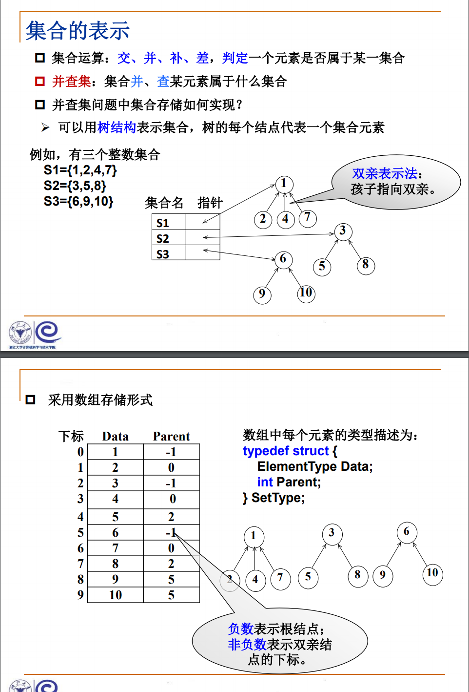

#### 集合的运算

1. 查找某个元素所在的集合

2. 集合的并运算
- 分别找到X1和X2两个元素所在集合树的根结点 
- 如果它们不同根，则将其中一个根结点的父结点指针设置成 另一个根结点的数组下标。

#### 改进的集合运算

>集合及运算中，我们定一个了一种结构体 SetType，结构体包含两部分内容：数据和父结点在 SetType 数组中的下标。
>
>如果现在数据是连续的，那么对于 N 个数据，我们可以建立一种映射，让这些数据和 0 ~ N - 1 一一对应。而 0 ~ N - 1 可以用大小为 N 的数组下标表示，对应的数组元素就是父节点的下标。

>但是这也存在问题：元素多的根不一定比元素低的根高。这个问题的优化，我们放到 File Transfer 中讲解