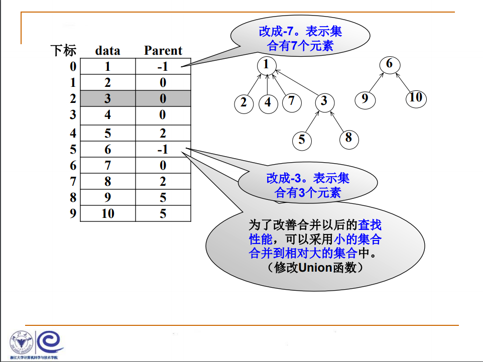
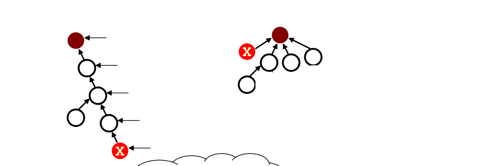

在完成这道题目之前，我们来将堆集合实现的两个优化：

#### 1. 按秩归并


##### 1. 比规模



实现：

```c
#define MAX_SET 10

typedef int ElementType;
typedef int SetName; /* 默认用根结点的下标作为集合名称 */
// SetType 类型为 ElementType[MAX_SET]
typedef ElementType SetType[MAX_SET]; /* 假设集合元素下标从0开始 */

// 上面的循环可以用递归来实现
SetName setFind(SetType S, ElementType X) {
	
	if (S[X] < 0)
		return X;
	else
		setFind(S, S[X]);
}

void Union(SetType S, SetName root1, SetName root2) {
	// 默认 root1 和 root2 是两个集合的根节点
	
	// 集合 root1 子节点多于 root2  
	if (S[root1] < S[root2]) {
		S[root1] += S[root2]; // 集合 2 并入集合 1
		S[root2] = root1; 
	}
	else {
		S[root2] += S[root1]; // 集合 1 并入集合 2
		S[root1] = root2;
	}
}
```

但是这也存在问题：元素多的根不一定比元素低的根高。

##### 2.按高度

```c
void Union(SetType S, SetName root1, SetName root2){
    // 数组 S 初始化都为 -1
    // root1 比 root2 高
    if(S[root1] < S[root2]){
        S[root2] = root1;
    }
    else{
        // root1，root2 等高，合并后高度加 1
        // 因为后面是将 root2 并到 root1 上，这里 root1 长度应该加1
        if(S[root1] == S[root2])  S[root1]--; 
        S[root1] = root2; 
    }
}
```


#### 2. 路径压缩

```c
SetName setFind(SetType S, ElementType X){
    if(S[X] < 0)
        return X;
    else
        return S[X] = setFind(S, S[X]);
}
```



### File Transfer

```c
#define _CRT_SECURE_NO_WARNINGS 1


#include<stdio.h>
#include<stdlib.h>
#include<string.h>

typedef int ElementType;
typedef int SetName;
typedef ElementType* SetType;


void creatSet(SetType* S, int size);
SetName setFind(SetType S, ElementType X);
void setUnion(SetType S, SetName root1, SetName root2);
void input_connection(SetType S);
void check_connection(SetType S);
void check_network(SetType S, int size);

int main(void) {

	int size;
	SetType S = NULL;
	char ch;

	scanf("%d", &size);

	creatSet(&S, size);// 注意要改变 S 的内容，需要传递 S 的指针

	do {
		scanf("%c", &ch);
		switch (ch) {
		case 'I': input_connection(S); break;
		case 'C': check_connection(S); break;
		case 'S': check_network(S, size); break;
		}
	} while (ch != 'S');

	return 0;
}

void input_connection(SetType S) {
	int n1, n2;
	SetName r1, r2;

	scanf("%d %d", &n1, &n2);

	r1 = setFind(S, n1 - 1);
	r2 = setFind(S, n2 - 1);
	if (r1 == r2)
		return;
	else
		setUnion(S, r1, r2);
}

void check_connection(SetType S) {

	int n1, n2;

	scanf("%d %d", &n1, &n2);

	if (setFind(S, n1 - 1) == setFind(S, n2 - 1))
		printf("yes\n");
	else
		printf("no\n");
}

void check_network(SetType S, int size) {

	int cnt = 0, i;

	for (i = 0; i < size; i++)
		S[i] < 0 ? cnt++ : cnt;

	if (cnt == 1)
		printf("The network is connected.\n");
	else
		printf("There are %d components.\n", cnt);
}


// 创建集合
void creatSet(SetType* S, int size) {
	*S = malloc(sizeof(ElementType) * size);
	memset(*S, -1, sizeof(ElementType) * size);
}

// 找到根 
SetName setFind(SetType S, ElementType X) {
	if (S[X] < 0)
		return X;
	else
		return S[X] = setFind(S, S[X]);
}

// 合并
void setUnion(SetType S, SetName root1, SetName root2) {
	if (S[root1] < S[root2]) {
		S[root2] = root1;
	}
	else {
		if (S[root1] == S[root2])  S[root1]--;
		S[root1] = root2;
	}
}
```
